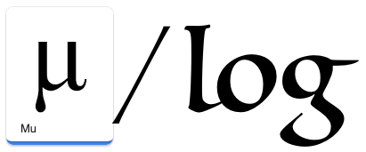

# μ/log
[](https://clojars.org/com.brunobonacci/mulog)  [](https://cljdoc.org/d/com.brunobonacci/mulog/CURRENT)  



***μ/log*** is a micro-logging library that logs data, not words!


> **μ**, **mu** *(Pronunciation: /mjuː/)* <br/>
> The twelfth letter of the
> Greek alphabet (Μ, μ), often used as a prefix for *mirco-* which is
> 10<sup>-6</sup> in the SI (System of Unis). Lowercase letter "`u`" is often
> substituted for "`μ`" when the Greek character is not typographically
> available.<p/>
> *(source: [https://en.wikipedia.org/wiki/Mu_(letter)](https://en.wikipedia.org/wiki/Mu_(letter)))*
> <br/>


## Usage

In order to use the library add the dependency to your `project.clj`

``` clojure
;; Leiningen project
[com.brunobonacci/mulog "0.1.0-SNAPSHOT"]

;; deps.edn format
{:deps { com.brunobonacci/mulog "0.1.0-SNAPSHOT" }}
```

Current version: [](https://clojars.org/com.brunobonacci/mulog)


Then require the namespace:

``` clojure
(ns foo.bar
  (:require [com.brunobonacci.mulog :as μ]))

;; or for the more ASCII traditional
(ns foo.bar
  (:require [com.brunobonacci.mulog :as u]))
```

Check the [online documentation](https://cljdoc.org/d/com.brunobonacci/mulog/CURRENT)

Then it's up to you...

## License

Copyright © 2019 Bruno Bonacci - Distributed under the [Apache License v2.0](http://www.apache.org/licenses/LICENSE-2.0)
