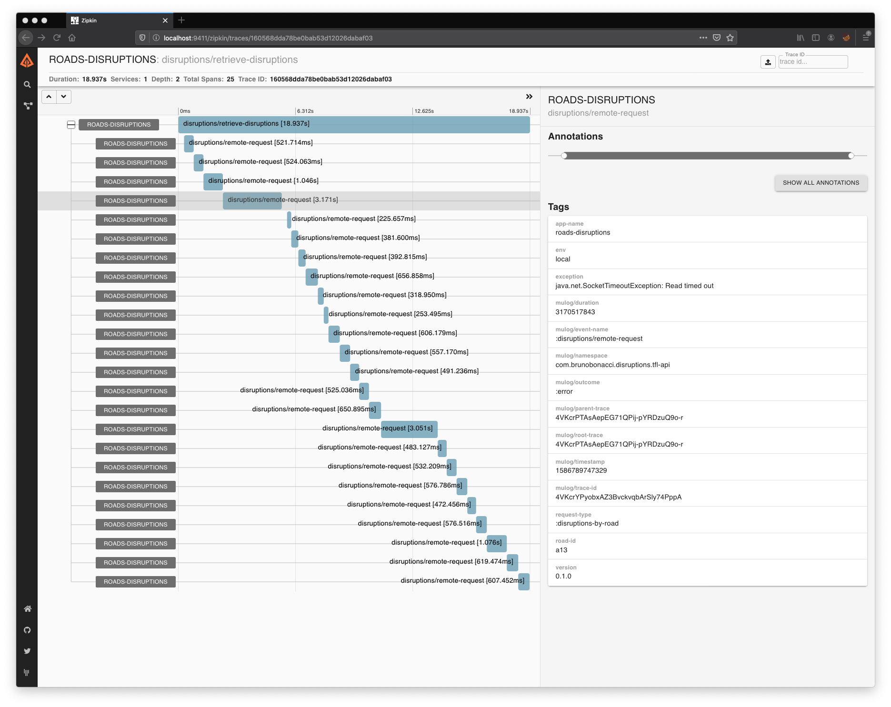

# roads-disruptions

This is a sample application to show the use of ***μ/log*** to log events
and instrument an application.

The application poll the [Transport For London (TFL)
API](https://api-portal.tfl.gov.uk/docs) for road disruptions.  It
tracks in realtime the disruptions to the main road corridors around
London (UK).  A REST api allow the user to list all active disruptions
around London.

***This project is intended for demonstration purpose only!***

## Testing

0. Prepare the network and create an alias with
``` shell
# on linux
sudo ip addr add 192.168.200.200/32 dev wlan0

# on Mac OSX
sudo ifconfig en0 alias 192.168.200.200/32 up

# to remove alias
# sudo ifconfig en0 -alias 192.168.200.200/32
```

Alternatively, edit the `docker-compose.yaml` and add your local ip (non 127.0.0.1).
This is necessary for the producer to connect to the broker.

1. Create a Slack Webhook at https://api.slack.com/messaging/webhooks.
2. Update `src/com/brunobonacci/disruptions/main.clj/DEFAULT-CONFIG`'s
   Slack Publisher's `:webhook-url` to the Webhook you created in the
   previous step, uncomment the configuration section
3. Start Kafka and ElasticSearch in background
``` shell
docker-compose rm -f && docker-compose up
```
4. Wait until all services are properly started and logs are settled.
5. Run the disruption service
``` shell
lein do clean, run
```
6. Open: http://localhost:9000/ for Kibana, click on **Management ->
   Index Patterns -> Create Index pattern**, then add the index
   pattern `mulog-*`, click **Next**, Choose `@timestamp` as time
   field, then click on **Create index pattern**.
7. Finally, Click on **Discover** and see the events as they arrive.
8. The same events should be printed in the console and in Kafka topic called **mulog**.
9. You can query the `roads-disruptions` on http://localhost:8000/ as follow:
``` shell
# to check the API status
curl -si http://localhost:8000/healthcheck

# to retrieve the current list of disruptions around London
curl -si http://localhost:8000/disruptions
```
Every interaction is logged in ***μ/log***.

The logs will be sent to the following destinations:

  - Console standard output
  - Filesystem: `/tmp/mulog/events.log`
  - Kafka topic: `mulog`
  - ElasticSearch index `mulog-YYYY.MM.DD`
  - Zipkin + ElasticSearch (console http://localhost:9411/)

To see the events sent to Kafka run:

``` shell
docker exec -ti roads-disruptions_broker_1 /usr/bin/kafka-console-consumer --bootstrap-server localhost:9093 --topic mulog
```

Here is an example of Zipkin traces:




Here a sample of the events that will be sent:

``` clojure
;; This event is sent at the application start
{:mulog/event-name :disruptions/app-started,
 :mulog/timestamp 1582624436517,
 :mulog/namespace "com.brunobonacci.disruptions.main",
 :app-name "roads-disruptions",
 :env "local",
 :version "0.1.0"}

;; This event is sent each time the remote api poll
;; is initiated
{:mulog/event-name :disruptions/initiated-poll,
 :mulog/timestamp 1582624488062,
 :mulog/namespace "com.brunobonacci.disruptions.api",
 :app-name "roads-disruptions",
 :env "local",
 :version "0.1.0"}

;; This event is sent when the application retrieve
;; the disruptions from the TFL api
{:mulog/event-name :disruptions/retrieve-disruptions,
 :mulog/timestamp 1582624488063,
 :mulog/duration 6442414196,
 :mulog/namespace "com.brunobonacci.disruptions.tfl-api",
 :mulog/outcome :ok,
 :app-name "roads-disruptions",
 :env "local",
 :version "0.1.0"}

;; This event is sent for each request to the remote
;; service to track request rate, errors, latency etc
{:mulog/event-name :disruptions/remote-request,
 :mulog/timestamp 1582624494065,
 :mulog/duration 359793125,
 :mulog/namespace "com.brunobonacci.disruptions.tfl-api",
 :mulog/outcome :ok,
 :app-name "roads-disruptions",
 :env "local",
 :http-status 200,
 :request-type :disruptions-by-road,
 :road-id "western cross route",
 :version "0.1.0"}

;; This event is sent when the list of disruptions
;; from the remote api is completed and it contains
;; the current count of active disruptions
{:mulog/event-name :disruptions/poll-completed,
 :mulog/timestamp 1582624494505,
 :mulog/namespace "com.brunobonacci.disruptions.api",
 :active-disruptions 75,
 :app-name "roads-disruptions",
 :env "local",
 :version "0.1.0"}

;; This event is sent for each http user request
;; it is used to track request rate, error rate,
;; response type, latency distribution
{:mulog/event-name :disruptions/http-request,
 :mulog/timestamp 1582624531635,
 :mulog/duration 867392,
 :mulog/namespace "com.brunobonacci.disruptions.api",
 :mulog/outcome :ok,
 :app-name "roads-disruptions",
 :content-encoding nil,
 :content-type "application/json",
 :env "local",
 :http-status 200,
 :request-method :get,
 :uri "/disruptions",
 :version "0.1.0"}
```
